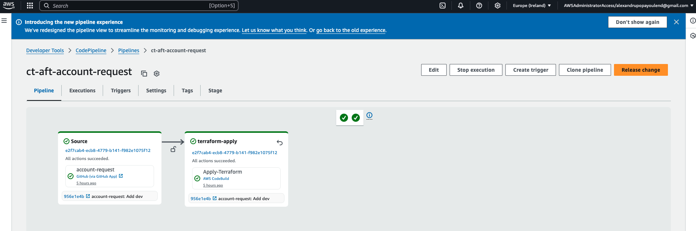
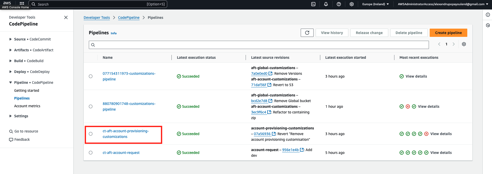
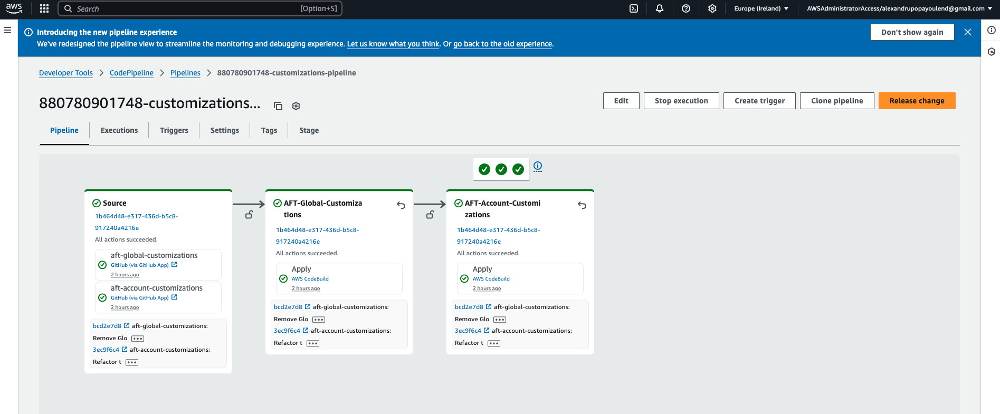
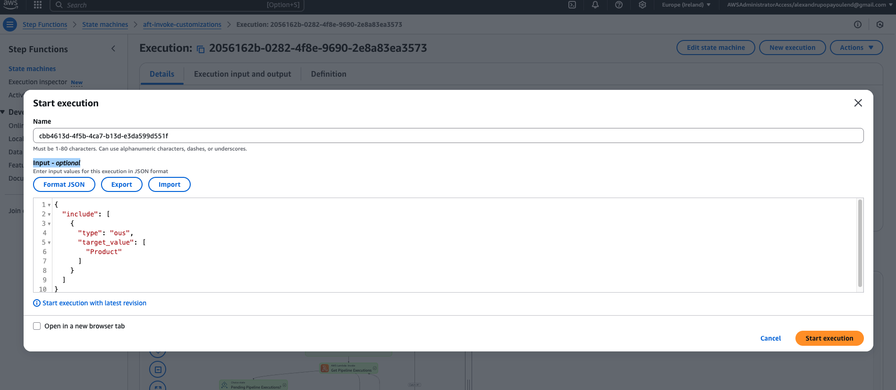
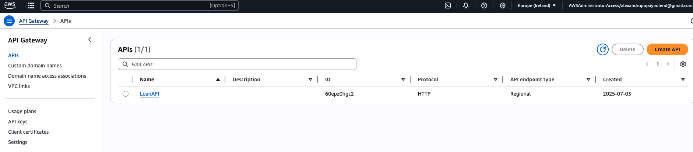

# Account Customizations

We will reuse code from [OmarFinance-React-App](https://github.com/onoureldin14/OmarFinance-React-App) to demonstrate the account Customization capabilities.

Terraform structure:

```
AFT/
└── tf-aws-ct-aft-workshop-account-customizations/
    ├── Dev (name of the account)/
    │   └── api_helpers/
    │   └── terraform/
    │           ├── lambda/
    │           ├── lambda.zip
    │           ├── aft-providers.jinja
    │           ├── api-gw.tf
    │           ├── backend.jinja
    │           ├── dynamodb.tf
    │           ├── iam.tf
    │           ├── lambda.tf
    │           ├── outputs.tf
    │           └── variables.tf
    ├── Sandbox/
    ├── .gitignore
    ├── LICENSE
    └── README.md
```

We can remove terraform.tf and backend.tf as this will be covered by aft-providers.jinja and backend.jinja, also make sure the lamba.zip exists or you create it (instructions in the [README.md](https://github.com/YouLend/tf-aws-ct-aft-workshop-account-customizations/blob/main/Dev/terraform/README.md))

## Triggered automatically by `ct-aft-account-request` CodePipeline.

Creating a new account trough AFT also triggers account and global customization being run for that account and applied if pre-existing.


## Trigger using  AFT Management Account CodePipeline: 

If the `ACCOUNT_NUMBER-customizations-pipeline` for the targeted account is missing please `Release change` for `ct-aft-account-provisioning-customizations`.



Or `Release change` for `ACCOUNT_NUMBER-customizations-pipeline`

 This will trigger both:
 - AFT-Global-Customizations
 - AFT-Account-Customizations



## Trigger using  AFT Management Account Step Functions 
Another option to trigger the account or global customizations is to trigger the `aft-invoke-customizations` state machine.

This has a mandatory input documented [here](https://docs.aws.amazon.com/controltower/latest/userguide/aft-account-customization-options.html#aft-re-invoke-customizations)



As a result we can see our resources deployed in the Dev account:
